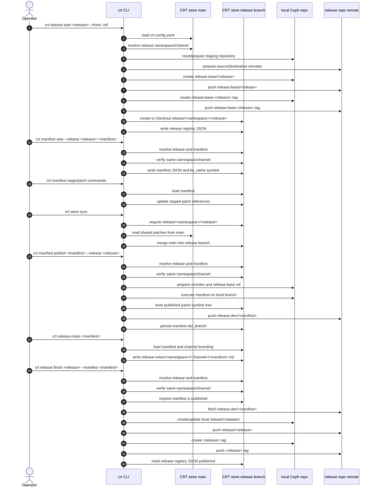

# CRT store format redesign

## Status

Draft.

## Context

CRT currently mixes product-specific assumptions, release metadata, manifest
metadata, patch storage, published patch trees, and release notes in a layout
that is not consistently namespace-aware. The branch starting at `6484b79`
proposes a redesign where a CRT store can host multiple namespaces and channels,
with release repositories and release-note branding driven by
`crt.config.yaml`.

The implementation must preserve a working release lifecycle at every commit:
release metadata creation, manifest creation, manifest publication, store branch
synchronization, release finalization, and local registry inspection.

## Goals

- Resolve release and manifest names through `crt.config.yaml`.
- Store release, manifest, published patch, and release-note artifacts under a
  namespace/channel-aware layout.
- Make the exact local and remote git effects of each release step explicit.
- Keep local CRT store state and remote release repository state consistent.
- Keep every logical commit compiling and operational for bisectability.

## Non-goals

- Change the downstream Ceph release branch naming scheme.
- Replace the existing Click CLI model.
- Add remote publication of the CRT store branch unless the command explicitly
  performs it or documents the operator step.
- Migrate existing store data in this design. A migration can be planned as a
  follow-up once the target format is stable.

## Store Configuration

The CRT store root contains `crt.config.yaml`.

The config declares:

- `component`: the top-level component directory, such as `ceph`.
- `namespaces`: namespace entries.
- `channels`: channel entries under each namespace.
- `release_repo`: the default downstream release repository for the channel.
- `branding`: release-note branding for the channel.

Channel prefixes used in release and manifest names must resolve to exactly one
namespace/channel pair. Duplicate channel prefixes across namespaces are invalid
unless commands require a namespace-qualified name in a future design.

## Store Layout

All path construction must be centralized and must derive the component directory
from the loaded store config.

Expected layout:

```text
<component>/releases/<namespace>/<channel>/<release>.json
<component>/manifests/<namespace>/<channel>/<uuid>.json
<component>/manifests/<namespace>/<channel>/by_name/<name>.json
<component>/patches/<uuid>.patch
<component>/patches/meta/<uuid>.json
<component>/patches/index/<org>/<repo>/<pr>/
<component>/published/<namespace>/<channel>/<version-path>/*.patch
release-notes/<namespace>/<channel>/<manifest>.md
```

The `by_name` manifest entry is a symlink to the UUID entry in the same
namespace/channel directory.

## Release Lifecycle

### `crt release start`

Inputs:

- release name
- `--from` manifest or `--ref` base reference
- optional destination repo override

Behavior:

1. Load `crt.config.yaml`.
2. Resolve the release name to namespace/channel.
3. Use the channel `release_repo` unless `--dst-repo` is provided.
4. Prepare the downstream Ceph repository remotes.
5. Create local downstream branch `release-base/<release>`.
6. Push `release-base/<release>` to the destination release repo unless
   running locally.
7. Create tag `release-base-<release>` and push it unless running locally.
8. Create or check out CRT store branch `release/<namespace>/<release>`.
9. Write release metadata on that CRT store branch under
   `<component>/releases/<namespace>/<channel>/<release>.json`.

Remote effects:

- Destination release repo receives branch `release-base/<release>`.
- Destination release repo receives tag `release-base-<release>`.
- CRT store remote is not changed unless a future explicit push option is added.

The command must either check out the store release branch before writing
metadata or clearly keep all release metadata on `main` and remove the store
branch concept. The branch-based design requires writing metadata on the release
store branch.

### `crt manifest new`

Inputs:

- release name
- manifest name

Behavior:

1. Resolve the manifest name to namespace/channel.
2. Resolve and load the release name.
3. Reject the command if release and manifest resolve to different
   namespace/channel pairs.
4. Store the manifest under the same namespace/channel as the release.

No remote repository is changed.

### `crt manifest publish`

Inputs:

- manifest name or UUID
- release name
- staging Ceph repository
- destination branch prefix, default `release-dev`

Behavior:

1. Resolve and load the manifest.
2. Resolve and load the release.
3. Reject the command if release and manifest resolve to different
   namespace/channel pairs.
4. Prepare downstream repository remotes.
5. Ensure the release-base branch and tag exist in the destination release repo.
6. Execute the manifest against the release-base branch.
7. Write published patch symlinks under
   `<component>/published/<namespace>/<channel>/<version-path>/`.
8. Push the executed local branch to
   `<manifest.dst_repo>/<prefix>/<manifest-name>`.
9. Persist `manifest.dst_branch`.

Remote effects:

- Destination release repo receives or updates branch
  `<prefix>/<manifest-name>`.

The current helper drift around release loading must be removed. Manifest publish
must use the namespace-aware release loader and must not call stale pre-redesign
APIs.

### `crt store sync`

Inputs:

- active CRT store branch

Behavior:

1. Require the current CRT store branch to be `release/<namespace>/<release>`.
2. Merge `main` into the active store release branch.
3. Leave conflict resolution to the operator when the merge fails.

No remote repository is changed unless the operator pushes the CRT store branch
afterward.

### `crt release finish`

Inputs:

- release name
- published manifest name or UUID
- staging Ceph repository

Behavior:

1. Resolve and load the release.
2. Resolve and load the manifest.
3. Reject the command if release and manifest resolve to different
   namespace/channel pairs.
4. Require the manifest to be published and to have `dst_branch`.
5. Fetch `manifest.dst_branch` from `manifest.dst_repo` to local
   `release/<release>`.
6. Push local `release/<release>` to `release.release_repo`.
7. Create and push tag `<release>` to `release.release_repo`.
8. Mark the release as published in the CRT store registry.

Remote effects:

- Release repo receives branch `release/<release>`.
- Release repo receives tag `<release>`.

The release repository receiving the final branch and tag must be the repository
stored in release metadata. The manifest source repository may differ only if the
operator intentionally published the manifest there and the namespace/channel
invariant still holds.

### `crt release list`

Behavior:

1. Load the local CRT store registry.
2. Optionally filter by namespace and channel.
3. Print local release metadata and publication status.

No GitHub token or remote access is required.

## Required Invariants

- A release and its manifests must share namespace and channel.
- A release name must resolve to exactly one configured channel.
- A manifest name must resolve to exactly one configured channel.
- Registry reads and writes must use the same path helper and component value.
- A local-only command must not require a GitHub token.
- Remote branch and tag writes must be explicit in command behavior.

## Release Flow Diagram



The same flow as explicit operator checkpoints:

```text
1. release start
   - local store: create/check out release/<namespace>/<release>
   - local store: write release metadata
   - release remote: push release-base/<release>
   - release remote: push release-base-<release>

2. manifest new and staging
   - local store: create manifest metadata under the same namespace/channel
   - local store: update stage and patch references
   - release remote: no changes

3. store sync
   - local store: merge main into release/<namespace>/<release>
   - release remote: no changes

4. manifest publish
   - local Ceph repo: execute manifest on a temporary/local branch
   - local store: create published patch symlinks
   - release remote: push release-dev/<manifest>
   - local store: persist manifest destination branch

5. release notes
   - local store: write release notes from channel branding
   - release remote: no changes

6. release finish
   - local Ceph repo: fetch release-dev/<manifest> as release/<release>
   - release remote: push release/<release>
   - release remote: push <release> tag
   - local store: mark release published
```

## Validation

Minimum validation before accepting the redesign:

- Unit tests for config loading and channel resolution.
- Unit tests for path construction with non-`ceph` component names.
- CLI or integration-style tests for release start metadata placement.
- CLI or integration-style tests rejecting release/manifest channel mismatch.
- CLI or integration-style tests for manifest publish release loading.
- CLI or integration-style tests showing `release list` works without a token.
- `python3 -m compileall -q crt/src/crt`
- `uv run ruff check crt/src/crt`

## Commit Plan

The current branch should be rewritten into logical, bisectable commits. Each
commit must compile and provide a complete capability.

1. `crt: add config-driven store identity`

   Add `crt.config.yaml` loading, validation, config errors, dependencies, and
   documentation. Wire only the command paths needed to validate release and
   manifest names in the same commit.

2. `crt: store registry entries by namespace and channel`

   Introduce centralized path helpers that consume the configured component
   value. Move release and manifest load/store/list/remove operations to the
   namespace/channel layout, including all CLI callers.

3. `crt: enforce release and manifest channel invariants`

   Make `manifest new`, `manifest publish`, and `release finish` reject
   namespace/channel mismatches. Fix stale release-loading helpers and remove
   duplicated release-repo preparation code that can drift.

4. `crt: create release store branches during release start`

   Add the CRT store branch workflow as a complete capability: create or switch
   to `release/<namespace>/<release>`, write release metadata on the intended
   branch, and print the branch in the summary. Document that remote store
   branch pushes are operator-managed unless an explicit push option is added.

5. `crt: publish manifests into namespace-aware store trees`

   Publish patch symlinks under the namespace/channel-aware path, persist the
   manifest `dst_branch`, and push the executed branch to the release repo.

6. `crt: read release lists from the local registry`

   Replace remote scanning with local registry listing and remove GitHub token
   requirements from local-only list/info commands.

7. `crt: generate release notes from channel branding`

   Use channel branding and namespace-aware release-note paths. Keep this
   separate because it is user-facing prose and can be reverted independently.

8. `crt: add patch search over store metadata`

   Add the patch search command and library code. This is useful but not part of
   the core release lifecycle, so it should remain separate.

9. `crt: add store sync for release branches`

   Add `crt store sync` after release store branches exist. Validate branch
   shape before merging `main`.

## Existing Commit Mapping

- `6484b79 crt: add config-driven namespace and channel validation`: keep, but
  revise so it only lands working config-driven validation and docs.
- `4356583 crt: centralize path construction and replace hardcoded paths`:
  change substantially. It must consume `config.component`, keep all callers
  compiling, and likely split if it remains too large.
- `aaef583 crt: add patch search module and CLI command`: keep as a later
  independent commit.
- `59387cc crt: replace hardcoded help text and error messages`: squash into
  the commits that touch the relevant commands. It is too small and not a
  standalone capability.
- `62ea774 crt: add release branch creation to release start`: keep concept, but
  revise to check out or otherwise intentionally write metadata on the store
  release branch.
- `aab7594 crt: read release list from local registry`: keep, but drop the
  GitHub token requirement and ensure it depends only on local registry state.
- `7110ba7 crt: add release finish summary with registry fields`: squash into
  the release finish changes. It is presentation for the lifecycle change.
- `bacdeab crt: add store sync command`: keep after the store branch commit, and
  validate branch names strictly enough for the namespace-aware workflow.
- `e59547c crt: config-driven release notes generation`: keep as a separate
  user-facing release notes commit.
- `c95554c crt: namespace-aware publish symlink trees`: squash into the manifest
  publish namespace-aware commit, because the symlink destination is part of that
  capability.
